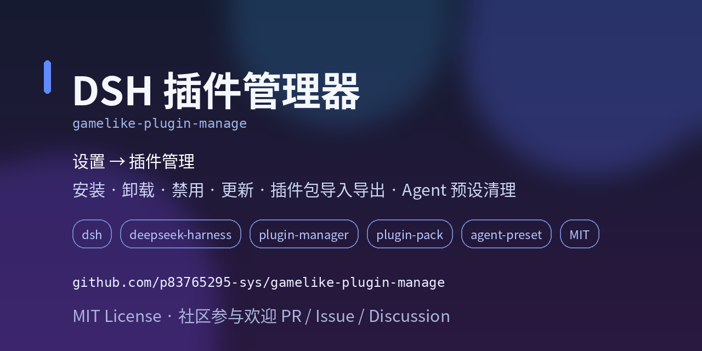

# gamelike-plugin-manage



DSH 插件管理器：入口位于 **设置 → 插件管理**。提供插件树管理、插件安装、插件分组与插件包导出。本项目可以帮你**查看、禁用、启用、卸载、更新 DSH 插件，批量安装第三方插件，打包/迁移插件集合，并在禁用或卸载插件时清理其自带的本地 Agent 预设**。

> 面向用户：本文是安装与使用教程。开发者文档见 [DEVELOPER.md](./DEVELOPER.md)。

**搜索关键词**：`DSH 插件管理` · `DeepSeek Harness plugin manager` · `插件安装` · `插件卸载` · `插件更新` · `插件包` · `plugin pack` · `Agent preset 管理` · `插件分组` · `整组启停` · `settings plugins` · `cordis loader` · `dsh-plugin` · `tgz`

## 快速上手

1. 先把本插件安装进 DSH（发布包 `.tgz`、GitHub 地址或本地目录均可，见下方安装方式）。
2. 打开 **设置 → 插件管理**。
3. 按页签使用：

| 页签 | 怎么用 |
|---|---|
| 管理插件 | 搜索 / 按来源过滤插件；禁用 / 启用直接写 patch 并热应用、立即生效；卸载写入待重启队列，点「重启 DSH」后生效，未重启前可取消卸载 |
| 插件安装 | 任选本地目录、拖拽 `.tgz`、GitHub 地址或 npm 指令；下方任务面板实时显示进度，失败可「交给 AI 配置」 |
| 开发插件 | 占位，后续开放 |
| 插件包 | ① 勾选插件并命名，创建插件包（一个插件可属于多个包）；② 查看已有插件包，可整包启用/禁用；③ 导出 `.tgz` 到其他机器，导入后自动恢复插件包与成员状态 |

**三个常用流程**

- 安装一个插件：`插件安装` → 拖入 `.tgz`（或填路径/地址）→ 等任务显示成功。
- 暂时停用一个插件：`管理插件` → 找到该插件 → 禁用，立即生效；再次点击启用即可恢复。
- 把一组插件搬到另一台机器：`插件包` → 创建插件包并勾选成员 → 导出 `.tgz` → 目标机器 `插件安装` 拖入该包。

## 功能

| 模块 | 说明 |
|---|---|
| 管理插件 | 查看运行中的全部插件；原生 / 用户 / 临时注入分类；禁用 / 启用热应用立即生效；卸载仅限用户插件并待重启；卸载/更新待重启时可一键重启 DSH |
| 插件安装 | 本地目录、拖拽 `.tgz`、GitHub 地址或 npm 指令；安装队列 + 进度；失败任务可「交给 AI 配置」 |
| 开发插件 | 占位，后续开放 |
| 插件包 | 将已安装的用户插件（无论启用/禁用）加入分组，导出为 `.tgz` 插件包（可折叠选择要导出的现有分组）；安装插件包后自动恢复分组 |

### 分组

- 分组是引用集合（tag）：一个插件可以同时属于多个分组。
- 分组会显示在「管理插件」列表，可一键「整组启用 / 整组禁用」。
- 分组与期望状态（`enabled` / `disabled` / `as-is`）会随插件包导出，并在安装时恢复。
- 同一插件出现在多个选中分组/多个插件包时，导出端只内嵌一份，导入端按身份去重。

## 安装到 DSH

任选一种：

1. **插件安装 Tab → 拖拽 `.tgz`**：适合安装已导出的插件包。
2. **GitHub 地址**：输入 `https://github.com/<owner>/<repo>`（自动 clone + 构建）。
3. **npm 指令**：输入 `npm install <pkg>` 或包名（自动 `npm pack` 后安装）。
4. **本地目录**：输入项目目录（含 `package.json` 与 `lib/`；若缺少 `lib/` 且勾选「允许执行构建脚本」会尝试构建）。

## 插件包格式（dsh-plugin-pack@2）

导出的 `.tgz` 解包结构：

```
<包名>.tgz
├── package.json      # 声明 dsh.pack.format = dsh-plugin-pack@2
├── manifest.yml      # 分组、期望状态、插件清单（name / path / version / sha256）
└── plugins/<包名>/   # 插件目录本体（不含 node_modules / .git）
```

导入时：

1. 逐成员校验 `sha256`（内容被篡改直接拒绝）；
2. 吸收进内容寻址 PluginStore（`~/.dsh/plugin-store/<name>/<version>-<hash>`），同内容交集复用同一实体；
3. 构建包级装配计划（InstallPlan），逐成员裁决；
4. 通过预检的成员写入 profile bundles（立即装配并持久化），任一成员装配失败则本包整体回滚；
5. 分组恢复到「管理插件」；
6. 按分组期望状态为运行中的插件写入待重启状态（重启后生效）。

兼容性：仍可导入 `dsh-plugin-pack@1` 旧包（无 version/sha256 声明时不校验内容，按包名判断交集）。

### 交集裁决规则

| 交集类型 | 裁决 |
|---|---|
| 同 name + 同 version + 同 sha256（安全交集） | 跳过，复用已装实体 |
| 同 name + 同 version + 不同 sha256（内容冲突） | 拒绝安装该成员，不静默覆盖 |
| 同 name + 不同 version（版本冲突） | 拒绝安装该成员，提示先卸载旧版或使用更新 |
| entry id / bundle patch id 被其它插件占用 | 拒绝安装该成员 |
| patch 顶层存在 disabled 覆盖（旧卸载意图） | 显式重新安装时清除覆盖，按包内版本装配 |
| 包内同 name 重复出现 | 只吸收一次（导出端已 seen 去重） |

## 开发与 API

构建、架构说明、模块职责与 HTTP API 清单见 [DEVELOPER.md](./DEVELOPER.md)。

## 安全策略

- 安装第三方仓库时，不执行其自带的 `install.ps1` / `install.sh` / git hooks。
- 依赖安装使用 `npm install --ignore-scripts`（不执行生命周期脚本）。
- 默认拒绝执行构建脚本；仅当用户勾选「允许执行构建脚本」后才运行 `npm rebuild` / `npm run build`。
- `git clone` 使用 `--depth 1`，失败自动清理残留。

## 免责声明

- 本项目不是 DeepSeek 官方产品，与 DeepSeek 无隶属或背书关系。
- 本软件按「现状」提供，不附带任何明示或默示的保证，包括但不限于适销性、特定用途适用性与不侵权的保证。
- 插件安装/更新、禁用/启用、卸载、重启 DSH、删除本地 Agent 预设等操作会修改 DSH 配置、进程或本地文件；使用前请确认操作内容，并自行备份重要配置与数据。
- 在适用法律允许的最大范围内，作者不对因使用或无法使用本软件而产生的任何直接、间接、附带、特殊或后果性损失承担责任。
- 使用本软件即表示你已知悉并接受上述风险。

## License

MIT
